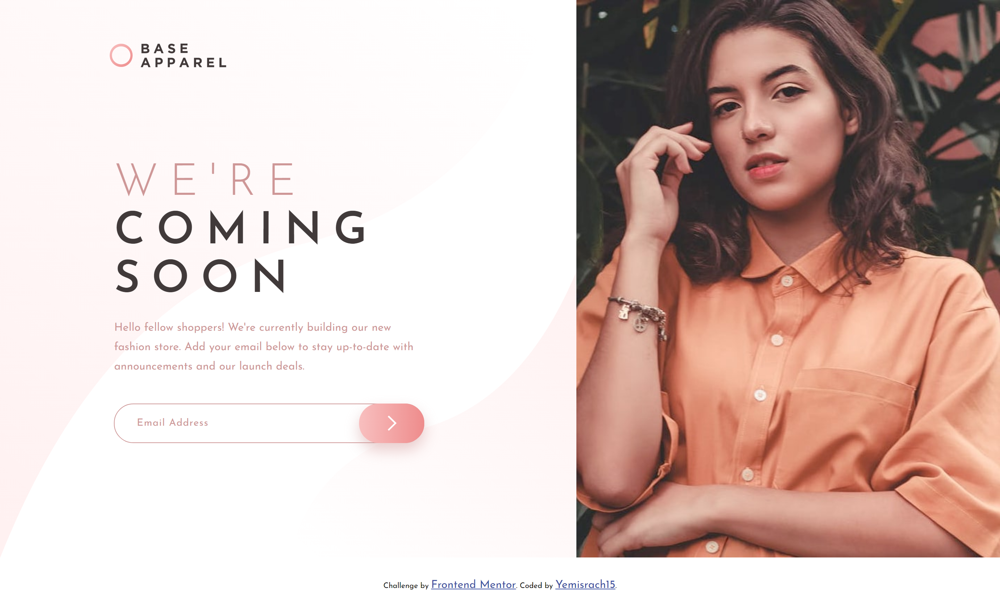
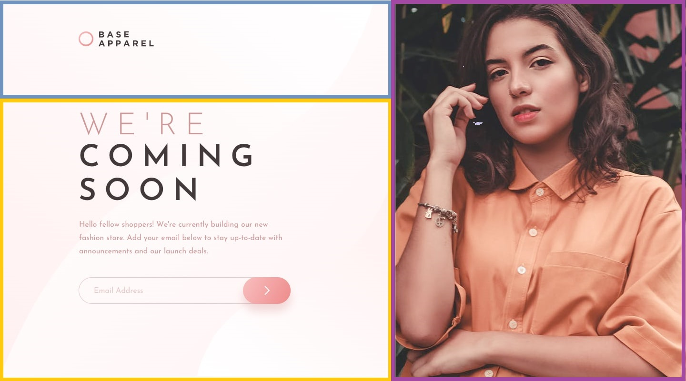

# Frontend Mentor - Base Apparel coming soon page solution

This is a solution to the [Base Apparel coming soon page challenge on Frontend Mentor](https://www.frontendmentor.io/challenges/base-apparel-coming-soon-page-5d46b47f8db8a7063f9331a0). Frontend Mentor challenges help you improve your coding skills by building realistic projects. 

## Table of contents

- [Overview](#overview)
  - [The challenge](#the-challenge)
  - [Screenshot](#screenshot)
  - [Links](#links)
- [My process](#my-process)
  - [Built with](#built-with)
  - [What I learned](#what-i-learned)
  - [Useful resources](#useful-resources)
- [Author](#author)


## Overview

### The challenge

Users should be able to:

- View the optimal layout for the site depending on their device's screen size
- See hover states for all interactive elements on the page
- Receive an error message when the `form` is submitted if:
  - The `input` field is empty
  - The email address is not formatted correctly

### Screenshot



### Links

- [Solution URL:](https://github.com/Yemisrach15/FEM/tree/main/base-apparel-coming-soon)
- [Live Site URL:](https://fem-base-apparel-coming-soon-kappa.vercel.app/)

## My process

I visualized the page to be composed of three components highlighted with rectangles in the below image. Grid layout seemed to be fit for the desktop design. As for the mobile design, the components are arranged according to the HTML flow. 



### Built with

- Semantic HTML5 markup
- CSS custom properties
- SASS/SCSS
- BEM
- CSS Grid
- Mobile-first workflow

### What I learned

Scaling SVGs is a difficult task and I've been struggling with it since I began using them. About a month ago, I stumbled upon an [article on css-tricks.com](https://css-tricks.com/scale-svg/#how-to-scale-svg-to-fit-the-available-width-and-adjust-the-height-to-match) when I was researching on this frustrating topic. Although I didn't go through the whole article, I read about a trick called the *padding-bottom* hack. It worked wonderfully😊. The SVG needs to be rendered as a background image and the below code should be added.

```css
.svg-container{
  height: 0;
  padding: 0; /* reset */
  padding-bottom: calc(100% * 3 / 4);
}
```

Here the percentage width *100%* is multiplied by desired height factor divided by desired width factor according to the article. I don't fully understand how this works but hopefully I will eventually.


### Useful resources

- [Scaling svg as background](https://css-tricks.com/scale-svg/#how-to-scale-svg-to-fit-the-available-width-and-adjust-the-height-to-match)

## Author

- Frontend Mentor - [@Yemisrach15](https://www.frontendmentor.io/profile/Yemisrach15)
