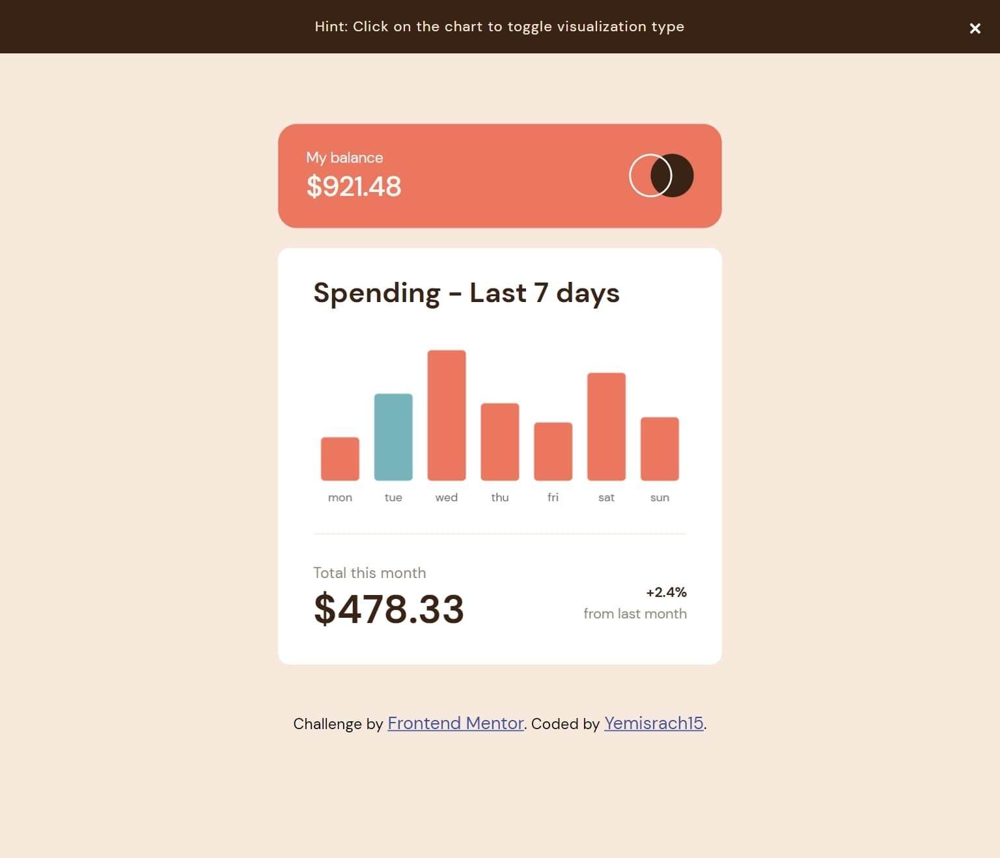
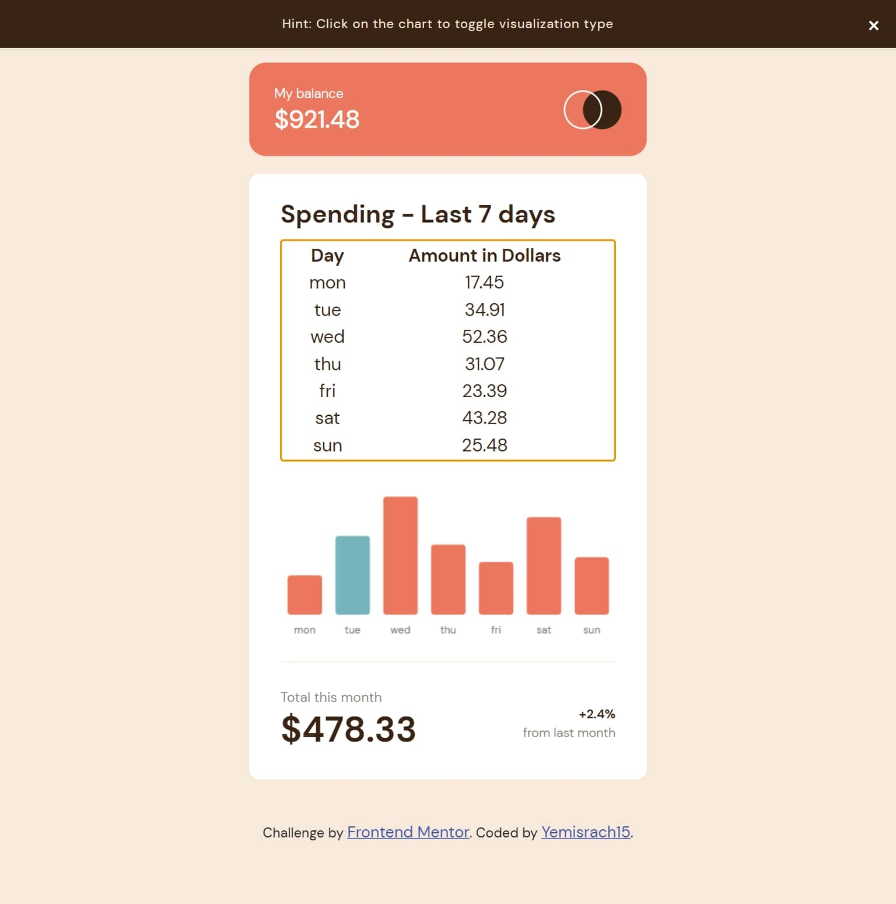
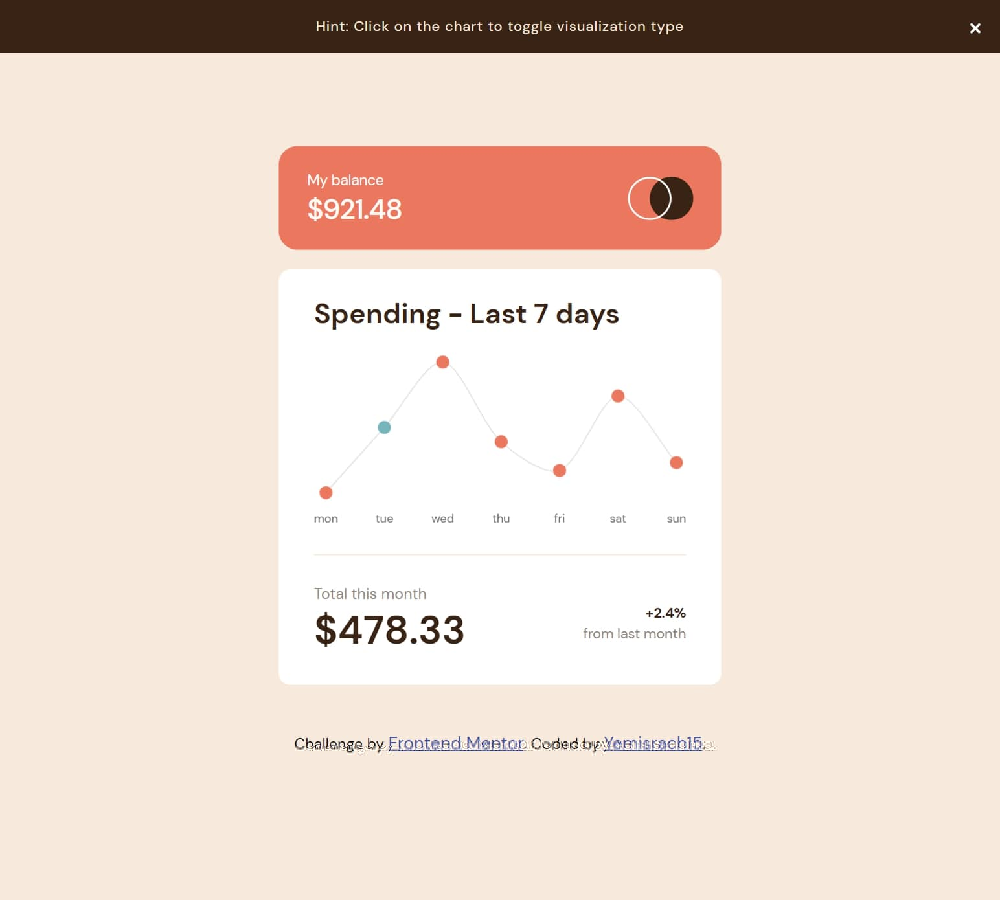

# Frontend Mentor - Expenses chart component solution

This is a solution to the [Expenses chart component challenge on Frontend Mentor](https://www.frontendmentor.io/challenges/expenses-chart-component-e7yJBUdjwt). Frontend Mentor challenges help you improve your coding skills by building realistic projects. 

## Table of contents

- [Overview](#overview)
  - [The challenge](#the-challenge)
  - [Screenshot](#screenshot)
  - [Links](#links)
- [My process](#my-process)
  - [Built with](#built-with)
  - [Workflow](#workflow)
  - [Useful resources](#useful-resources)
- [Author](#author)

## Overview

### The challenge

Users should be able to:

- View the bar chart and hover over the individual bars to see the correct amounts for each day
- See the current day’s bar highlighted in a different colour to the other bars
- View the optimal layout for the content depending on their device’s screen size
- See hover states for all interactive elements on the page
- **Bonus**: Use the JSON data file provided to dynamically size the bars on the chart

### Screenshot



### Links

- [Solution URL](https://github.com/Yemisrach15/FEM/tree/main/expenses-chart-component)
- [Live Site URL](https://fem-expenses-chart-component-yemisrach15.vercel.app/)

## My process

### Built with

- [React](https://reactjs.org/) - JS library
- [Styled Components](https://styled-components.com/) - For styles
- [ChartJS](https://www.chartjs.org/docs/latest/) - Open source HTML5 Charts
- [TypeScript](https://www.typescriptlang.org/) - To help catch mistakes early
- [Vite](https://vitejs.dev/) - Blazing-fast tool for scaffolding and bundling projects
- Semantic and accessible HTML5 markup
- Mobile-first workflow

### Workflow

This challenge is pretty simple allowing me to focus on how data is visualized on the web/HTML. Searching 'chart html' gave ChartJS as the first result thus I decided to use it. Although there are npm packages that make it convenient to use it in React, I did not want to add to the size of the project when I'll be using one or two components from these packages. So as you can see under `src/components/Chart`, I constructed a bar and line chart only using the ChartJS library. The only thing we have to do is create a `Canvas` element and pass its context to ChartJS. In React, we get the context inside `useEffect` on first load. We also have to destroy the chart when it is unloaded from the browser page. 

``` tsx
import Chart from 'chart.js/auto';

const BarChart = () => {
	const chartRef = React.createRef<HTMLCnavasElement>();

	React.useEffect(() => {
		const ctx = chartRef.current?.getContext('2d');
		const barChart = new Chart(ctx!, { type: 'bar' });

		return () => { // Function to execute on component unload
			barChart.destroy();
		}
	}, []);

	return (
		<canvas ref={chartRef}></canvas>
	);
}
```

>As pointed out on [MDN](https://developer.mozilla.org/en-US/docs/Web/HTML/Element/canvas#usage_notes), alternate content for browsers that do not support the `Canvas` element or browsers that have javascript disabled should be provided inside the `Canvas` block.

Based on my light search, accessibility for the `Canvas` element is a concern that does not have a concrete or common solution. [A resource on w3.org](https://www.w3.org/WAI/tutorials/images/complex/) states four approaches for complex images including charts and graphs. I used the third approach that suggests to structurally associate the chart with its long description with the `figure` element. The long description is a data table. [A website](https://pauljadam.com/demos/canvas.html) suggested on [ChartJS documentation](https://www.chartjs.org/docs/latest/general/accessibility.html) considers a canvas element with an alternative via data table as good example (Go to section *Good example: Canvas element with text alternative via data table*). Combining the two findings, I wrapped the canvas in a `figure` and provided the data table in a `figcaption` element. 

```html
<figure>
	<figcaption>
		<h2>Spending - Last 7 days</h2>
		<table>
			<!-- data table goes here -->
		</table>
	</figcaption>
	<canvas></canvas> <!-- figure - chart -->
</figure>
```

I hide the table with `CSS` for visual users while making it accessible to screen readers for visually impaired users. Currently, the `canvas` element is not interactive, meaning keyboard users can not access the value you get when hovering over the bars. To overcome this, I made the table focusable so that it can be made visible by detecting when it receives focus. The `table` has a `tabindex` of `0` to make it focusable.



> As a bonus, I added a line chart to the project. I used the same approach as the bar chart. The only difference is that I used the `line` type instead of `bar` and adjusted some options. You can click on the chart to toggle between the two. 



### Useful resources

- [Web Accessibility Initiative (WAI) tutorial for complex images](https://www.w3.org/WAI/tutorials/images/complex/) - This helped me understand the different approaches for providing alternative content or long descriptions for complex images including charts and graphs.

## Author

- Frontend Mentor - [@Yemisrach15](https://www.frontendmentor.io/profile/Yemisrach15)
- Medium - [@Yemisrach15](https://medium.com/@Yemisrach15)
- GitHub - [@Yemisrach15](https://github.com/Yemisrach15)
