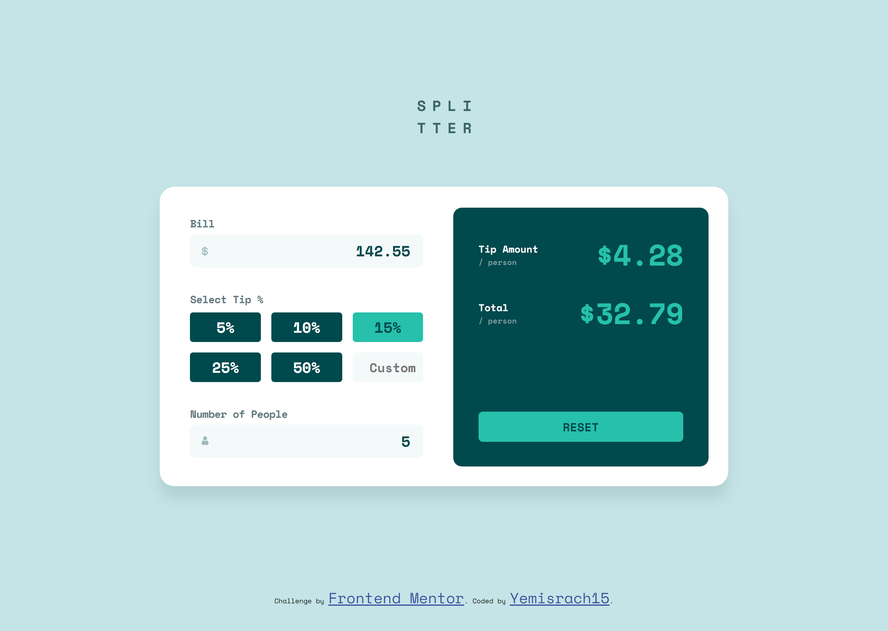

# Frontend Mentor - Tip calculator app solution

This is a solution to the [Tip calculator app challenge on Frontend Mentor](https://www.frontendmentor.io/challenges/tip-calculator-app-ugJNGbJUX). Frontend Mentor challenges help you improve your coding skills by building realistic projects.

## Table of contents

- [Overview](#overview)
  - [The challenge](#the-challenge)
  - [Screenshot](#screenshot)
  - [Links](#links)
- [My process](#my-process)
  - [Built with](#built-with)
  - [What I learned](#what-i-learned)
  - [Useful resources](#useful-resources)
- [Author](#author)

## Overview

### The challenge

Users should be able to:

- View the optimal layout for the app depending on their device's screen size
- See hover states for all interactive elements on the page
- Calculate the correct tip and total cost of the bill per person

### Screenshot



### Links

- [Solution URL](https://github.com/Yemisrach15/FEM/tree/main/tip-calculator-app)
- [Live site URL](https://fem-tip-calculator-app.vercel.app/)

## My process

The design for this challenege can be visualized to be composed of several boxes of which some are indicated with colored rectangles in the image below. A bigger box contains smaller boxes and those smaller boxes themselves contain other smaller boxes. For this reason, flexbox seemed to be a great fit. 


### Built with

- Semantic HTML5 markup
- CSS custom properties
- CSS Flexbox
- SASS/SCSS
- BEM
- Mobile-first workflow

### What I learned

While doing this challenge, I learned about sass placeholder selectors. They are useful when different selectors share common styles. A placeholder selector starts with a **%** followed by its name. 

```css
%transition-on-hover{ // placeholder selector
    transition: .2s ease-in;
}
```

Then it can be extended by selectors using the sass keyword **@extend**. This does not prevent you from adding other styles to the selector. So you can use the placeholder selector and also add custom css. For instance, `.form__label` below has extended `%transition-on-hover` but it additionally has a custom red color. 

```css
.form__label{
    color: red;
    @extend %transition-on-hover;
}
```

This significantly helps in writing less code and reusing code. When some modification is to be made to that common style, you only have to modify at one place (on the placeholder selector) rather than searching and modifiying every instance where that style exists. 

Another lesson I learned is `<input>` does not have `::after` and `::before` pseudo elements. Initially I was planning to use pseudo elements on `<input>` to add the icons but obviously it didn't work. [This article](https://www.scottohara.me/blog/2014/06/24/pseudo-element-input.html) taught me a hack. What you need to do is wrap the `<input>` with a `<div>` or `<span>` in my case and add the pseudo element to that wrapper. The pseudo element is then absolute positioned relative to the wrapper. 

```html
<span class="icon">
  <input class="form__input" name="bill" type="number" placeholder="0" min="0">
</span>
```

```css
.icon{
  position: relative;
}

.icon::before{
  content: '';
  background: url('some-icon.svg') no-repeat;
  background-size: contain;
  position: absolute;
  top: 35%;
  left: 5%;
}
```

The final result looks like this 👇


This challenge also made me recap on JS and it was fun, really. There is no built-in function to check whether a value is numeric or not. But as always, stackoverflow has solutions. Here's what I found.

```js
function isNumeric(n){
    return !isNaN(parseFloat(n)) && isFinite(n);
}
```

The funciton returns true if the parameter is not **NaN** (Not a Number) and is finite (Not inifinity). 

### Useful resources

- [Sass: Placeholder selectors](https://sass-lang.com/documentation/style-rules/placeholder-selectors)
- [Pesudo-element hack for input](https://www.scottohara.me/blog/2014/06/24/pseudo-element-input.html) 
- [Validate numbers in JS](https://stackoverflow.com/questions/18082/validate-decimal-numbers-in-javascript-isnumeric)

## Author

- Frontend Mentor - [@Yemisrach15](https://www.frontendmentor.io/profile/Yemisrach15)
